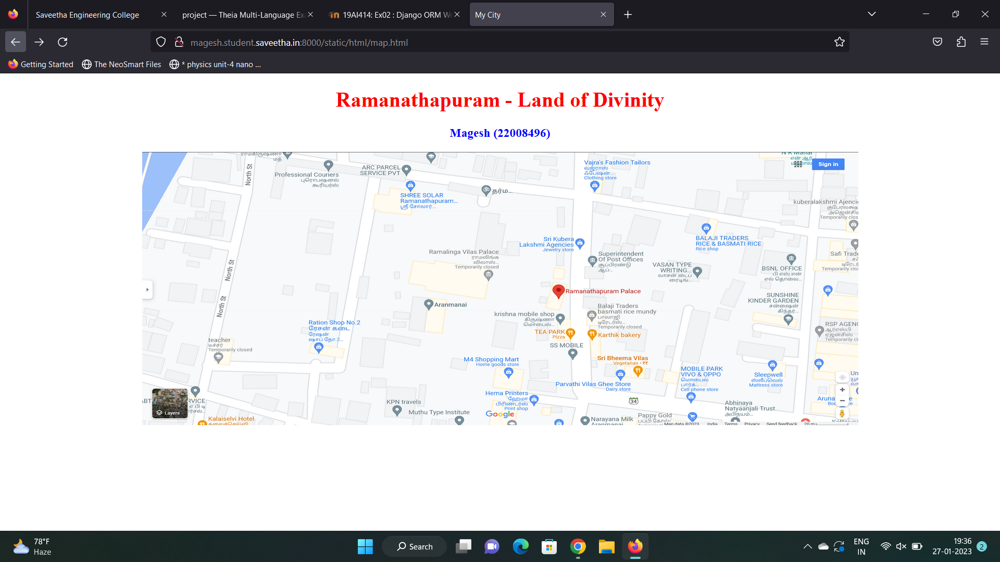
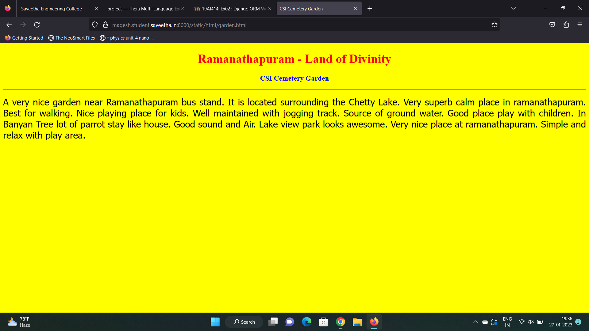
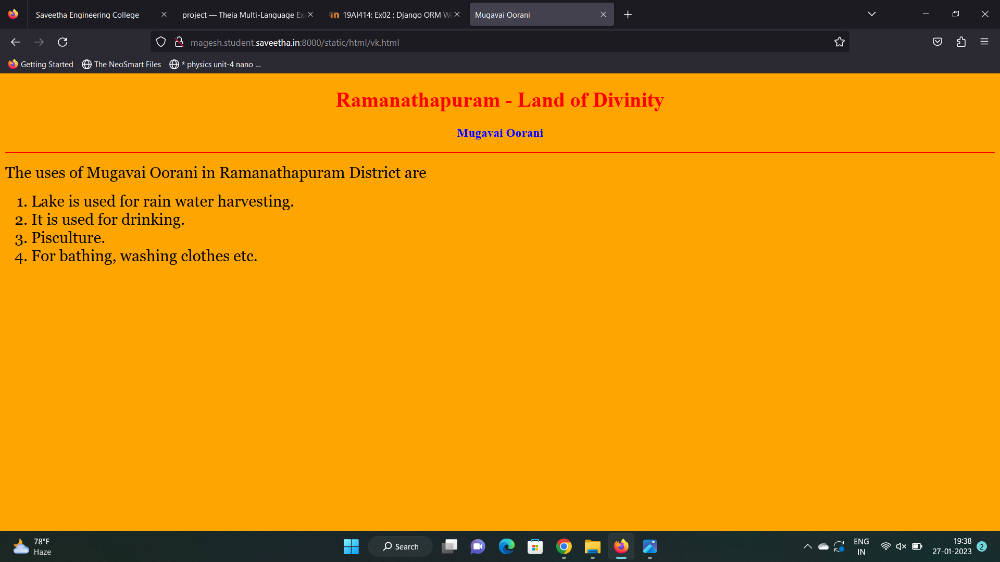
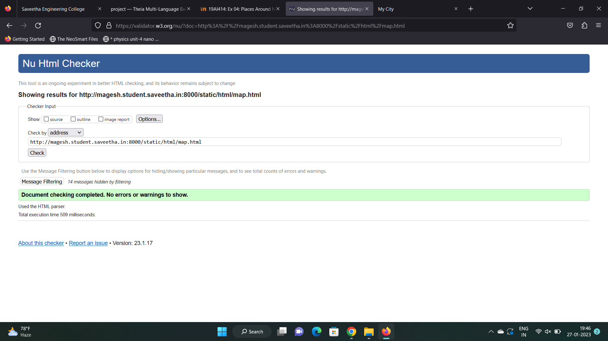

# Places Around Me
## AIM:
To develop a website to display details about the places around my house.

## Design Steps:

### Step 1:
Clone the github repository into Theia IDE.

### Step 2:
Create a new Django project

### Step 3:
Write the needed HTML code.

### Step 4:
Run the Django server and execute the HTML files. 

## Code:
'''
map.html
<!DOCTYPE html>
<html lang="en">
<head>
<title>My City</title>
</head>
<body>
<h1 align="center">
<b>Ramanathapuram - Land of Divinity</b>
</h1>
<h3 align="center">
<b>Magesh (22008496)</b>
</h3>

<map name="MyCity">
<area shape="circle" coords="190,50,20" href="/static/html/gh.html" title="Govt. Hospital">
<area shape="rectangle" coords="230,30,260,60" href="/static/html/akr.html" title="AKR Express Parcel Service">
<area shape="circle" coords="400,350,50" href="/static/html/vk.html" title="Mugavai Oorani">
<area shape="circle" coords="400,200,75" href="/static/html/bus.html" title="Ramanathpuram Bus Stand">
<area shape="rectangle" coords="490,150,870,320" href="/static/html/garden.html" title="CSI Cemetery Garden">
</map>

</body>
</html>

bus.html
<!DOCTYPE html>
<html lang="en">
<head>
<title>Bus Stand</title>
</head>
<body bgcolor="cyan">
<h1 align="center">
<b>Ramanathapuram - Land of Divinity</b>
</h1>
<h3 align="center">
<b>Hi-Tech Bus Stand</b>
</h3>

<b>
Ramanathapuram District, also known as Ramnad District, is one of the 38 districts an administrative districts of Tamil Nadu state in southern India.
The old Ramanathapuram District consists of Present day Virudhunagar and Sivagangai districts, it touches the Western ghats and bordered with the state of Kerala and east by Bay of Bengal.
It was the largest district on that time.
The town of Ramanathapuram is the district headquarters.
Ramanthapuram District has an area of 4,123 km2.
It is bounded on the north by Sivaganga District, on the northeast by Pudukkottai District, on the east by the Palk Strait, on the south by the Gulf of Mannar, on the west by Thoothukudi District, and on the northwest by Virudhunagar District.
The district contains the Pamban Bridge, an east–west chain of low islands and shallow reefs that extend between India and the island nation of Sri Lanka, and separate the Palk Strait from the Gulf of Mannar.
The Palk Strait is navigable only by shallow-draft vessels.
As of 2011, Ramanathapuram district had a population of 1,353,445 with a sex-ratio of 983 females for every 1,000 males.
The district is home to the pilgrimage center of Rameswaram. 
</b>

</body>
</html>

garden.html
<!DOCTYPE html>
<html lang="en">
<head>
<title>CSI Cemetery Garden</title>
</head>
<body bgcolor="yellow">
<h1 align="center">
<b>Ramanathapuram - Land of Divinity</b>
</h1>
<h3 align="center">
<b>CSI Cemetery Garden</b>
</h3>

A very nice garden near Ramanathapuram bus stand. It is located surrounding the Chetty Lake. 
Very superb calm place in ramanathapuram. Best for walking. Nice playing place for kids.
Well maintained with jogging track. Source of ground water.
Good place play with children.  In Banyan Tree lot of parrot stay like house. 
Good sound and Air. Lake view park looks awesome.
Very nice place at ramanathapuram.
Simple and relax with play area.

</body>
</html>

akr.html
<!DOCTYPE html>
<html lang="en">
<head>
<title>AKR Express Parcel Service</title>
</head>
<body bgcolor="pink">
<h1 align="center">
<b>Ramanathapuram - Land of Divinity</b>
</h1>
<h3 align="center">
<b>AKR Express Parcel Service</b>
</h3>

<b>
AKR Express Parcel Service is To make life easy, by prioritising safe deliveries on time, all the time!
Innovators from the get-go. Basic facilities such as Overnight Operations, Door Delivery, Door Pick-up, 100% Container Vehicles, were rare in our industry back then.
We steered the industry forward by implementing these facilities right from Day 01.
We were also the first in the industry to introduce SMS Alerts & SMS Tracking.
</b>

</body>
</html>

gh.html
<!DOCTYPE html>
<html lang="en">
<head>
<title>Govt. Hospital</title>
</head>
<body bgcolor="lime">
<h1 align="center">
<b>Ramanathapuram - Land of Divinity</b>
</h1>
<h3 align="center">
<b>Government Hospital</b>
</h3>

The main objectives of Ramanathapuram Government Hospital are 
<ul>
<li>To impart proper and qualified training to doctors and give them an attractive salary and incentives so that they are not tempted to quit and look elsewhere for jobs.</li>
<li>To provide financial aids and grants wisely and judiciously.</li>
<li>To Frame of syllabus and curriculum.</li>
<li>To set aims and objectives of medicine.</li>
</ul>

</body>
</html>

vk.html
<!DOCTYPE html>
<html lang="en">
<head>
<title>Mugavai Oorani</title>
</head>
<body bgcolor="orange">
<h1 align="center">
<b>Ramanathapuram - Land of Divinity</b>
</h1>
<h3 align="center">
<b>Mugavai Oorani</b>
</h3>

The uses of Mugavai Oorani in Ramanathapuram District are 
<ol type="1">
<li>Lake is used for rain water harvesting.</li>
<li>It is used for drinking.</li>
<li>Pisculture.</li>
<li>For bathing, washing clothes etc.</li>
</ol>

</body>
</html>
'''

## Output:

## HTML Validator

## Result:
The program for implementing image map is executed successfully